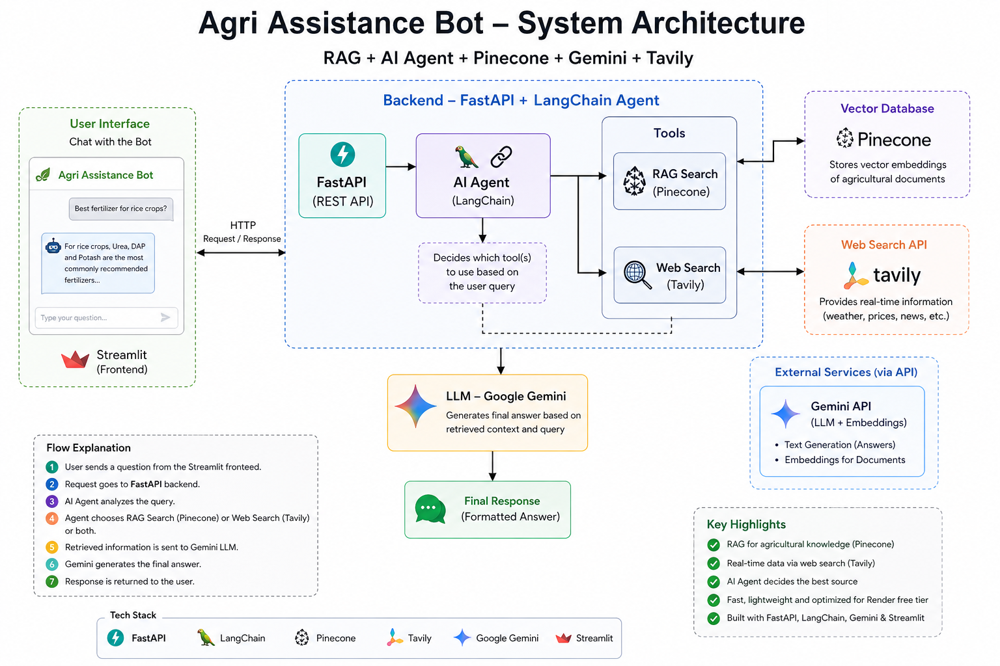
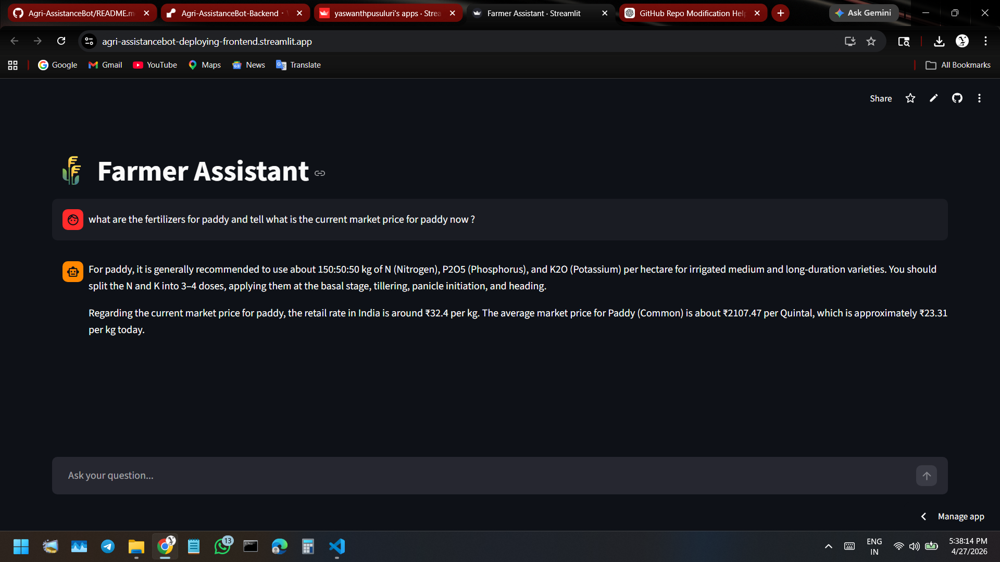

# 🌾 Agri Assistance Bot (RAG + AI Agent + Pinecone)

An **AI-powered agricultural assistant** that provides accurate, real-time answers to farming-related questions using:

* 📄 **RAG (Retrieval-Augmented Generation)** 
* 🌐 **Live Web Search** 
* 🤖 **Agent-based decision making** using LangChain
* 🧠 **Google Gemini LLM** for response generation

---

## 🌐 Live Demo

### 🚀 Frontend (Streamlit App)

👉 https://agri-assistancebot-deploying-frontend.streamlit.app/

### 🔧 Backend API (FastAPI Docs)

👉 https://agri-assistancebot-backend.onrender.com/docs

---

### 💡 How to Use

1. Open the frontend link
2. Ask any agriculture-related question
3. The system will:

   * Use **RAG (Pinecone)** for stored knowledge
   * Use **Web Search (Tavily)** for real-time data
4. Get a clear AI-generated response

---

### ⚠️ Notes

* First request may take **30–60 seconds** (Render cold start)
* API keys are securely handled via environment variables

---

## 🎯 Project Objective

To build a **smart farming assistant** that helps users (farmers, students, researchers) get:

* Crop-related guidance
* Fertilizer recommendations
* Disease information
* Real-time updates (weather, prices, news)

---

## 🧠 System Architecture

```
User Query
    ↓
AI Agent (LangChain)
    ↓
 ┌───────────────┬────────────────┐
 │               │                │
RAG Search   Web Search     (optional both)
(Pinecone)   (Tavily API)
 │               │
 └───────┬───────┘
         ↓
   Gemini LLM
         ↓
   Final Answer
```

---

## ⚙️ How It Works

1. User submits a query
2. AI Agent decides:

   * RAG → domain knowledge
   * Web → real-time info
3. Data retrieved from:

   * Pinecone (vector DB)
   * Tavily API
4. Gemini generates final response

---

## 🔥 Key Features

* 🤖 AI Agent with tool selection
* 📄 Semantic search using Pinecone
* 🌐 Real-time web search
* ⚡ Lightweight & optimized for deployment
* 💬 Streamlit chat UI
* 🧠 Stateless backend (no memory)

---

## 🧠 Conversation Design

* ❌ No backend chat memory
* ❌ Each query is independent
* ✅ Fast & scalable
* ✅ Avoids memory-related issues

---

## 🛠️ Tech Stack

### 🔹 Backend

* FastAPI
* LangChain
* Google Gemini API
* Pinecone
* Tavily API
* Python-dotenv
* python-3.10.11

### 🔹 Frontend

* Streamlit
* Requests

---

## 📂 Project Structure

```
Agri-AssistanceBot/
│
├── Backend/
│   ├── main.py
│   ├── requirements.txt
│   ├── runtime.txt
│
├── Frontend/
│   ├── app.py
│   ├── requirements.txt
│
├── build_vectorstore.py
├── data/
│   ├── Crops.pdf
│   ├── crop_diseases.json
│   ├── crop_fertilizers.txt
│  
└── README.md
```

---

## ⚙️ Local Setup

### 1. Clone Repo

```bash
git clone https://github.com/yaswanthpusuluri/Agri-AssistanceBot.git
cd Agri-AssistanceBot
```

### 2. Backend Setup

```bash
cd Backend
pip install -r requirements.txt
```

### 3. Environment Variables

```
GOOGLE_API_KEY=your_key
TAVILY_API_KEY=your_key
PINECONE_API_KEY=your_key
PINECONE_INDEX_NAME=farmer-db
```

### 4. Run Backend

```bash
uvicorn main:app --reload
```

### 5. Run Frontend

```bash
cd ../Frontend
pip install -r requirements.txt
streamlit run app.py
```

---

## ⚠️ Embedding Model Choice

* ✅ Best accuracy: `sentence-transformers/all-mpnet-base-v2`
* ⚡ Used for deployment: `sentence-transformers/all-MiniLM-L6-v2`

### 💡 Why?

* **mpnet-base-v2** → higher semantic accuracy
* **MiniLM-L6-v2** → faster, lightweight, deployable

👉 Use mpnet for powerful systems
👉 Use MiniLM for low-resource deployment

> In this project, API-based embeddings (Gemini) are also used to reduce local load.

---

## 🚀 Deployment

### 🔹 Backend (Render)

        Recommended Version Range 

        FastAPI: 0.100.0 or higher (latest is 0.136.1) 

        Streamlit: 1.12.0 or higher (latest is 1.53+) 

        Python: 3.10–3.14

  

* Root: `Backend`

**Build**

```bash
pip install -r requirements.txt

NOTE: Please use Python-3.10.11  or range : python> 3.10 to 3.13> python.
```

**Start**

```bash
uvicorn main:app --host 0.0.0.0 --port $PORT
```

---

### 🔹 Frontend (Streamlit Cloud)

* File: `Frontend/app.py`

Update:

```python
API_URL = "https://agri-assistancebot-backend.onrender.com/ask"
```

---

## Achitecture Diagram



### 🖥️ Chat Interface


---

## 🧩 Challenges Faced & Optimizations

### 🚫 Render Free Tier Limits

* 512MB RAM + low CPU
* Optimized system for low-resource usage

### 🔄 Vector DB Evolution

* FAISS ❌
* Chroma ⚠️
* Pinecone ✅

### ⚡ Embedding Optimization

* Removed heavy local models
* Switched to API-based embeddings

### 🔧 Tool Optimization

* Reduced unnecessary tools
* Improved agent efficiency

### 🔐 API-Based Architecture

* Fully API-driven system
* Minimal local computation

---

## ⚠️ Limitations

* No multi-turn conversation
* Depends on external APIs
* Cold start delay

---

## 🔮 Future Improvements

* 🌍 Multilingual support
* 🎤 Voice assistant
* 📱 Mobile UI
* 🧠 Add memory
* 📊 Real-time datasets

---

## 👨‍💻 Author

Portfolio project demonstrating:

* RAG systems
* AI agents
* Full-stack deployment

---

## ⭐ Support

If you like this project, give it a ⭐ on GitHub!
